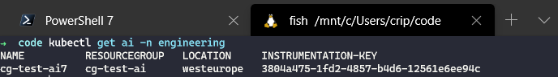
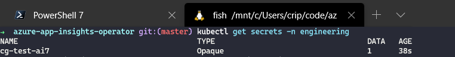

[](https://craigg.visualstudio.com/Pipelines/_build/latest?definitionId=21&branchName=master)

# Kubernetes Operator for Application Insights

> :construction: This project is experimental and may contain bugs

This is a Kuberetes operator for Azure Application insights. The goal of this operator is to aid in the development of .NET applications that use Applcation Insights for telemetry. It allows Application Insights to become a first class citizen inside the cluster and be configured and deployed alongside other Kubernetes resources.

When an Application Insights resource is deployed to a cluster the following will happen:

* A new Application Insights resource is deployed to the namespace that has been specified in the request.
* A new Application Insights resource is deployed in to the Azure tenant/subscription specified in config and configured with the information provided in the `spec` section of the manifest.
* An opaque secret is created in the same namespace that contains the instrumentation key of the deployed Application Insights resource. This can be linked to a deployment and consumed by your application.

A simple resource looks like this:

```yaml
apiVersion: chelnak.github.io/v1apha1
kind: AzureApplicationInsights
metadata:
  name: k8s-test-ai
spec:
  resourcegroup: k8s-test-ai
  location: westeurope
```

The operator was built with [KOPF](https://github.com/zalando-incubator/kopf) created by [zalando](https://www.zalando.co.uk/).

## Installation

1. Install the default kopf peerings

```bash
kubectl apply -f resources/kopf-peering.yml
```

2. Install custom resource definitions for the operator

```bash
kubectl apply -f resourcs/app_insights_operator_crd.yml
```

3. Configure rbac for the operator

```bash
kubectl apply -f resourcs/app_insights_operator_rbac.yml
```

4. Deploy the operator

```bash
kubectl apply -f resourcs/app_insights_operator_deployment.yml
```

5. Deploy a test App Insights resource

```bash
kubectl apply -f resourcs/app_insights_resource.yml
```

6. Validate the existence of the new resources:

```bash
kubectl get ai
```



```bash
kubectl get secrets
```



## Configuration

The following table contains the environment variables required to use this operator.

| Setting  | Required | Default |
|----------|----------|---------|
| AZURE_CLIENT_ID | Yes | Null |
| AZURE_CLIENT_SECRET | Yes | Null |
| AZURE_SUBSCRIPTION_ID | Yes | Null |
| AZURE_TENANT_ID | Yes | Null |

### Azure App Registration

The app registration used to configure the operator will need permission to create/update/delete resource groups and Applicatio insights instances in the subscription specified by `AZURE_SUBSCRIPTION_ID`.
